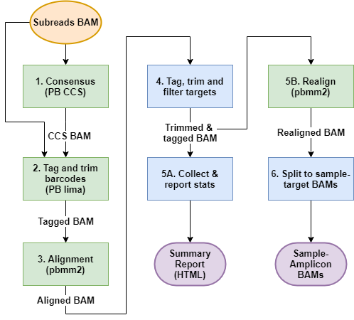
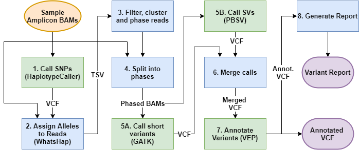

# **PLASTER**: Phased Long Allele Sequence Typing with Error Removal

## Installation

* TBD

## Pipeline Stages

### 1) Pre-processing

1. **Consensus**  
Circular consensus sequences are produced using PacBio's CCS tool with the recommend minimum 3 passes and minimum 0.99 accuracy.  
1. **Tag and trim barcodes**  
PacBio's lima tool is used along with the set of input barcode sequences to tag reads with barcode identity and to trim the barcode and adapter sequence. This is done for all CCS reads, as well as subreads that failed the CCS process for QC purposes.  
**3. Alignment**  
CCS reads and subreads are aligned to the reference genome (hg38) using the PacBio's minimap2 wrapper pbmm2.  
1. **Tag, filter and trim targets**  
A custom python script 'bam_annotate_trim_amplicons.py' is used to identify reads from a given target amplicon by alignment position and matching the forward and reverse primers. Reads lacking the correctly oriented forward and reverse primers are filtered out, and remaining reads are trimmed to the primer sites. Bam tags are used to store read metadata.
1. **Collect & report stats**  
Custom Rmarkdown script that generates the 'PacBio AmpSeq Preprocessing Report'. This report shows a breakdown of the numbers reads assigned to each amplicon, reads that produced CCS, reads that were able to be barcoded, and reads that have correct primer pair orientation ('complete' reads).  
1. **Realignment**  
BAM files are realigned after trimming  
1. **Split to sample-target BAMs**  
Monolithic CCS BAM file is split into separate BAM files for each unique sample target amplicon  

### 2) Fusion Calling  
    
**Note:** (optional, CYP2D6 only)  

1. TBD  

### 3) Allele-typing

1. **Call SNPs**  
GATK HaplotypeCaller is used to generate SNV calls in diploid mode for each sample-amplicon.  
1. **Assign Alleles to Reads**  
The set of alleles carried by individual reads is determined using WhatsHap Haplotag and a custom python script, and output as a table.  
1. **Filter, Cluster and Phase Reads**  
Several filters are applied to reads and variants in an iterative process to remove noise, outliers, chimeras and uninformative sites based variant allele frequencies. Pairwise SNP distance is then calculated between the reads and subsequently used for clustering. Clusters are determined using k-medoids (partitioning around medoids) with k values from 2-4 trialled, with the largest 2 clusters selected in each case (assuming 2 phases). Several heuristic filters are then applied to the clustering results to select the best clustering. If no 2-phase clustering is found the reads are assumed to be single-phase (i.e. Hemi/homozygous). See visualisation below.  
1. **Split Reads into Phases**  
Sample-amplicon BAMs are separated into individual phased BAMs based on the results of step 3
1. **Call short variants**  
SNPs and Indels are jointly-called using GATK HaplotypeCaller and GenotypeGVCFs with ploidy set to 1.  
1. **Call Structural Variants**  
SVs are jointly called using 'pbsv discover' and 'pbsv call'. This tools only produces diploid calls which aren't appropriate for the single-phase input BAMs, so a custom python script 'vcf_dip_to_hap.py' is used to convert heterozygous diploid calls to haploid calls based on a threshold of 0.5 B-allele frequency.  
1. **Merge Calls**  
All calls are merged into a single VCF, with haploid sample phases merged into phased diploid calls.  
1. **Annotate Variants**  
Ensembl VEP is used to provided annotations including reference population allele frequencies and variant effect predictions.  
1. **Generate Report**  
An html report summarise variant calls for each amplicon is generated based on an Rmarkdown script. See example variant report.  

### 4) Star Allele Assignment (CYP2D6 only)  

**Note:** (CYP2D6 only)  
1. TBD  
